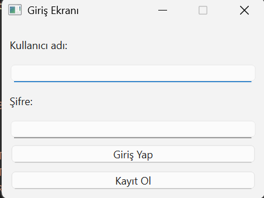

# Masaüstü Uygulaması
## Beyza KIZILAY

## Sağlık Hesaplayıcı (PyQt6 + MySQL) Uygulaması Proje Tanıtımı

Bu proje, kullanıcıların vücut kitle indeksi (BMI) hesaplaması yapabilmesini ve sonuçları veritabanında saklamasını sağlayan bir masaüstü uygulamasıdır.

<a href=https://drive.google.com/file/d/1ywfdWTlj2yeO3At4mPb69o01KhzwOlLE/view?usp=sharing>Videoyu izlemek için tıklayınız...
</a>">Videoyu izlemek için tıklayınız...
</a>
## Özellikler
-Kullanıcı Kaydı & Girişi

-Kullanıcılar yeni hesap açabilir veya mevcut hesaplarıyla giriş yapabilir.

-BMI Hesaplama

-Boy ve kilo bilgileri girildiğinde BMI değeri hesaplanır.

-Sonuç, Zayıf / Normal / Fazla Kilo / Obez olarak sınıflandırılır.

-Kullanıcıya ayrıca ideal kilo bilgisi verilir.

-Veritabanı Kaydı

-Kullanıcı bilgileri kullanicilar tablosunda tutulur.

-BMI hesaplama geçmişi bmi_kayit tablosuna kaydedilir.

## Kullanılan Teknolojiler
-Python

-PyQt6 (GUI arayüzü)

-MySQL (veri saklama)

Her işlev ayrı modüllerle organize edilmiştir, bu sayede kod okunabilir ve yönetilebilir.

## Exe Dosyası
---------------------
<a href="https://drive.google.com/file/d/1EszO9RdTTV7UCIQ0iCSFo0wvzsQCDW8N/view?usp=sharing">Exe dosyasına ulaşmak için tıklayınız...</a>

## Giriş Eranı   

Kullanıcı adı ve şifre ile sisteme giriş yapılır. Yeni kullanıcı iseniz Kayıt Ol butonuyla hesap oluşturabilirsiniz.

-----------------------------------------

## Sağlık Hesaplama Ekranı

Giriş yaptıktan sonra açılan ekranda boy ve kilo bilgilerinizi girerek BMI hesaplayabilirsiniz.

-----------------------------------------

## Sağlık Hesaplama Sonuç Ekranı

Girilen boy ve kilo bilgilerine göre; BMI değeri hesaplanır, durum bilgisi (Zayıf / Normal / Fazla Kilo / Obez) gösterilir.Ayrıca ideal kilo bilgisi de kullanıcıya sunulur.

-----------------------------------------
